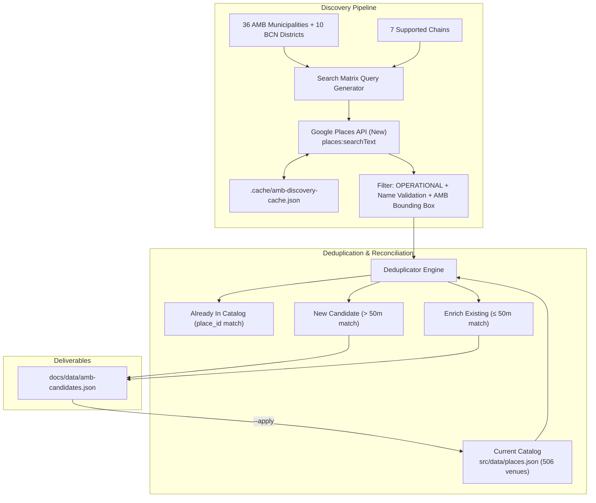

# AMB Cafe Discovery & Catalog Reconciliation Design

## Summary

Expand the Workable BCN cafe catalogue from central Barcelona to the entire Barcelona Metropolitan Area (Área Metropolitana de Barcelona - AMB), covering all 36 official municipalities across 7 supported chains (`365 Café`, `Granier`, `Vivari`, `Santagloria`, `El Fornet`, `SandwiChez`, `Buenas Migas`) using Google Places API (New) Text Search with multi-level deduplication and non-breaking incremental imports.

---

## 1. Problem & Objectives

1. **Geographic Limitation:** The current catalogue contains 506 cafes mostly concentrated within Barcelona municipal borders. Dense neighboring cities in the metropolitan area (such as L'Hospitalet de Llobregat, Badalona, Santa Coloma de Gramenet, Cornellà, Sant Cugat del Vallès) have dozens of uncatalogued locations of our target chains.
2. **Missing Official Sources for Key Chains:** Networks like Vivari have no active online locator or public API. Google Places API is the single authoritative source to systematically discover operating locations across all 36 municipalities.
3. **Automated Discovery & Deduplication:** Provide a repeatable CLI tool `scripts/discover-amb-cafes.mjs` that discovers operational branches, deduplicates them against our current 506 places, and safely enriches the catalog.

---

## 2. Architecture & Components

### 2.1 Target Geography (36 AMB Municipalities)

1. Barcelona (split by 10 districts: Ciutat Vella, Eixample, Sants-Montjuïc, Les Corts, Sarrià-Sant Gervasi, Gràcia, Horta-Guinardó, Nou Barris, Sant Andreu, Sant Martí).
2. L'Hospitalet de Llobregat
3. Badalona
4. Santa Coloma de Gramenet
5. Cornellà de Llobregat
6. Sant Boi de Llobregat
7. Sant Cugat del Vallès
8. El Prat de Llobregat
9. Viladecans
10. Castelldefels
11. Cerdanyola del Vallès
12. Esplugues de Llobregat
13. Gavà
14. Sant Feliu de Llobregat
15. Ripollet
16. Sant Adrià de Besòs
17. Montcada i Reixac
18. Sant Joan Despí
19. Barberà del Vallès
20. Sant Vicenç dels Horts
21. Sant Andreu de la Barca
22. Molins de Rei
23. Santa Coloma de Cervelló
24. Begues
25. Castellbisbal
26. Corbera de Llobregat
27. El Papiol
28. La Palma de Cervelló
29. Pallejà
30. Sant Climent de Llobregat
31. Sant Just Desvern
32. Torrelles de Llobregat
33. Tiana
34. Montgat
35. Badia del Vallès
36. Cervelló

Bounding box constraint:
- Latitude: $41.20 \le \text{lat} \le 41.55$
- Longitude: $1.90 \le \text{lon} \le 2.35$

### 2.2 Chains & Search Token Configuration

| Chain | Search Tokens | Brand Match RegEx |
|---|---|---|
| 365 Café | `365 Obrador`, `365 Cafe` | `/\b365\b/i` |
| Granier | `Granier` | `/granier/i` |
| Vivari | `Vivari` | `/vivari/i` |
| Santagloria | `Santagloria` | `/santagloria/i` |
| El Fornet | `El Fornet` | `/fornet/i` |
| SandwiChez | `Sandwichez` | `/sandwich/i` |
| Buenas Migas | `Buenas Migas` | `/buenas\s*migas/i` |

### 2.3 Deduplication Engine Rules

1. **Global Place ID Deduplication:** Deduplicate all raw results from Google across queries by `cand.id`.
2. **Catalog Place ID Match:** If `cand.id === existing.googlePlaceId`, mark as `ALREADY_IN_CATALOG`.
3. **Proximity & Chain Match ($\le 50$ meters):**
   - For an existing venue of the same chain within 50m:
     - If the existing venue already has `googlePlaceId`, mark as `ALREADY_IN_CATALOG`.
     - If the existing venue is missing `googlePlaceId`, mark as `ENRICH_EXISTING` and populate its `googlePlaceId` and `googleMapsUrl`.
4. **New Candidate Discovery ($> 50$ meters):**
   - If no existing venue of the same chain exists within 50m and the `place_id` is new:
     - Create new catalog entry candidate.
     - Generate canonical ID: `${chainSlug}-${lat.toFixed(6)}-${lon.toFixed(6)}`.
     - Standardize address: `${street}, ${number} · ${municipality}`.
     - Set `verification: { status: 'listed', checkedAt: '<YYYY-MM-DD>', sourceUrl: cand.googleMapsUri }`.
     - Set `googlePlaceId: cand.id`, `googleMapsUrl: cand.googleMapsUri`.

### 2.4 CLI Interface (`scripts/discover-amb-cafes.mjs`)

- `node scripts/discover-amb-cafes.mjs`:
  Dry-run discovery. Generates cache, produces `docs/data/amb-candidates.json`, prints terminal summary.
- `node scripts/discover-amb-cafes.mjs --apply`:
  Applies discoveries: writes new candidates to `src/data/places.json`, enriches existing records with missing Place IDs, and runs integrity checks.
- Optional parameters:
  - `--api-key=<KEY>` or `GOOGLE_MAPS_API_KEY` from `.env`.
  - `--cache-file=<PATH>` (default: `.cache/amb-discovery-cache.json`).
  - `--cities=<List>` (e.g. `--cities="Badalona,L'Hospitalet de Llobregat"`).
  - `--chains=<List>` (e.g. `--chains="Vivari,Granier"`).

---

## 3. npm Scripts

Add to `package.json`:
- `"discover:amb": "node scripts/discover-amb-cafes.mjs"`
- `"discover:amb:apply": "node scripts/discover-amb-cafes.mjs --apply"`

---

## 4. Verification Plan

### Automated Tests
1. `tests/discover-amb.test.ts`:
   - Unit test AMB bounding box filtering.
   - Unit test brand name regex matching.
   - Unit test multi-level deduplication ($\le 50$m enrich vs $> 50$m new candidate).
   - Unit test normalized address formatting with municipality.
2. `npm run check:places`:
   - Ensures all new records conform to schema, unique IDs, coordinate bounds, and legacy ID preservation.
3. `npm run typecheck`:
   - Validates TypeScript typing.

### Manual Verification
- Run `npm run discover:amb` with caching.
- Inspect `docs/data/amb-candidates.json` for accuracy across municipalities.
- Run `npm run discover:amb:apply` and verify `places.json` update.
