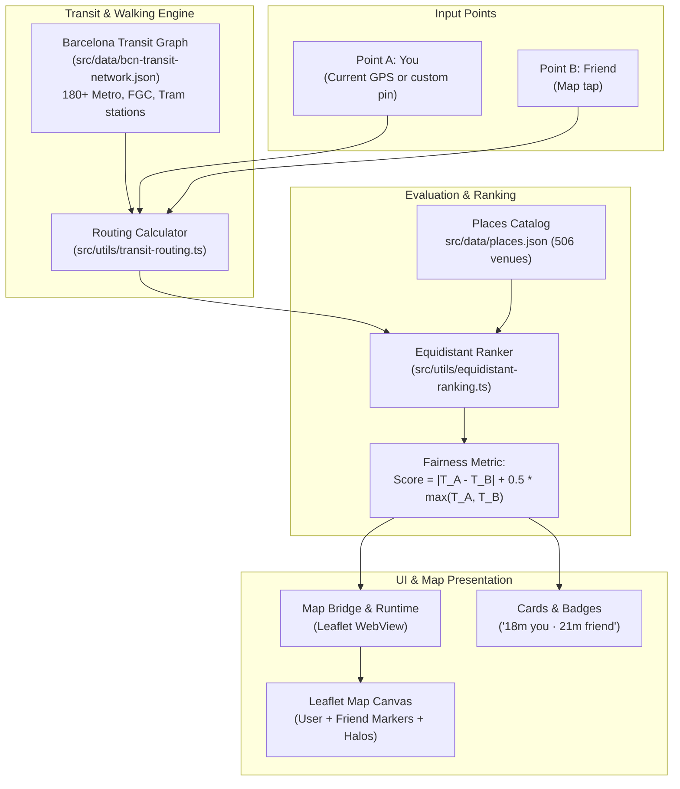

# Equidistant Cafes: Travel Time & Fair Meeting Point Design

## Summary

Enable users to find cafes in Barcelona that are fair and equidistant for two people (e.g., two friends meeting up to work remotely), ranked not just by geographic distance, but by estimated real travel time using an embedded Barcelona rapid transit network model (Metro, FGC, Tram) and urban walking routing. The feature is 100% client-side, zero-cost, zero-latency, works offline, and requires no external API keys or server infrastructure.

---

## 1. Problem & User Objectives

1. **The Remote Work Meetup Dilemma:** When two people in different parts of Barcelona (e.g. Gràcia and Poblenou, or Sants and Sagrada Família) want to meet at a laptop-friendly cafe to work, choosing a spot equidistant in pure kilometers often produces poor compromises. Geographical midpoints can fall into transit dead-zones, steep elevation areas, or across barriers, while a spot on a direct metro line might be twice as fast to reach despite being farther in straight-line distance.
2. **Zero-API, Zero-Latency Constraint:** Workable BCN is an offline-friendly, privacy-preserving mobile guide with no backend and no Google Maps API keys. Solutions relying on Google Routes API or external Transit APIs would incur recurring costs, require API keys, suffer network latency, and fail when offline.
3. **Core Objectives:**
   - Allow setting two starting points: **Point A (You)** (defaults to current GPS location, editable) and **Point B (Friend)** (set by tapping anywhere on the map).
   - Evaluate all 506+ cafes against both points in $< 5\text{ ms}$ on the device JavaScript thread.
   - Automatically determine the best route mode (Transit vs Walking) for each person independently.
   - Rank cafes using a fairness-first cost function that minimizes travel time difference while penalizing excessive travel.
   - Provide clear visual cues on the Leaflet map and place cards with exact travel time breakdowns for both people.

---

## 2. Architecture & Data Flow



---

## 3. Barcelona Transit Network Engine (`src/data/bcn-transit-network.json`)

### 3.1 Network Scope & Geometry
The dataset covers the rapid transit network of Barcelona and direct inner-suburb extensions:
* **TMB Metro Lines:** L1 (Hospital de Bellvitge – Fondo), L2 (Paral·lel – Badalona Pompeu Fabra), L3 (Zona Universitària – Trinitat Nova), L4 (La Pau – Trinitat Nova), L5 (Cornellà Centre – Vall d'Hebron), L9 Nord / L9 Sud, L10 Nord / L10 Sud, L11.
* **FGC Urban Lines:** L6 (Pl. Catalunya – Sarrià), L7 (Pl. Catalunya – Av. Tibidabo), L8 (Pl. Espanya – Molí Nou), L12 (Reina Elisenda – Finestrelles).
* **Tram Lines:** Trambaix (T1, T2, T3: Francesc Macià – Baix Llobregat) and Trambesòs (T4, T5, T6: Glòries / Ciutadella – Besòs / Badalona).

### 3.2 Graph Representation
Each station node is defined as:
```typescript
export type TransitStation = {
  id: string;
  name: string;
  lines: string[];
  latitude: number;
  longitude: number;
  connections: { targetId: string; travelMinutes: number; line: string }[];
};
```
* **Inter-station travel time:** ~1.5 to 2.0 minutes per hop (empirically derived from official TMB schedule averages).
* **Transfer penalty:** 3.5 minutes added when switching lines at transfer hubs (e.g. Catalunya, Passeig de Gràcia, Diagonal, Sagrera, Espanya, Verdaguer).

### 3.3 Travel Time Computation Algorithm (`src/utils/transit-routing.ts`)
For any origin coordinate $O$ and destination cafe coordinate $C$:
1. **Urban Walking Model:**
   * Direct Haversine distance corrected by urban street grid factor: $d_{\text{urban}} = d_{\text{haversine}}(O, C) \times 1.25$.
   * Walking speed $v_{\text{walk}} = 80\text{ m/min}$ ($4.8\text{ km/h}$).
   * $T_{\text{walk}}(O, C) = \text{round}(d_{\text{urban}} / v_{\text{walk}})$.
2. **Transit Model:**
   * Find candidate boarding stations within $1.2\text{ km}$ of origin $O$.
   * Find candidate alighting stations within $1.2\text{ km}$ of destination $C$.
   * If both sets are non-empty, compute shortest station-to-station transit path using a priority queue (Dijkstra) over the preloaded transit graph.
   * $T_{\text{transit}}(O, C) = T_{\text{walk}}(O \to S_{\text{in}}) + T_{\text{wait}} (3\text{ min}) + T_{\text{ride}}(S_{\text{in}} \to S_{\text{out}}) + T_{\text{walk}}(S_{\text{out}} \to C)$.
3. **Optimal Selection:**
   * $T_{\text{best}} = \min(T_{\text{walk}}, T_{\text{transit}})$.
   * Result: `{ minutes: number, mode: 'walk' | 'transit', stationIn?: string, stationOut?: string }`.

---

## 4. Fairness Ranking & Equidistant Score (`src/utils/equidistant-ranking.ts`)

Given travel time for person A ($T_A$) and person B ($T_B$):
1. **Primary Score Formula:**
   $$\text{Score} = |T_A - T_B| + 0.5 \times \max(T_A, T_B)$$
   * **Fairness term ($|T_A - T_B|$):** Penalizes any asymmetry in travel time.
   * **Efficiency term ($0.5 \times \max(T_A, T_B)$):** Penalizes pushing both people too far away (e.g., into outer suburbs) just to achieve mathematical equality.
2. **Secondary Tie-Breaking:**
   * If scores are within $1.0$, sort by lowest combined straight-line distance: $D_A + D_B$.
3. **Meeting Area Filtering (`filterMeetingPlaces`):**
   * Computes the intersection radius $R = \max(D \times 0.58, \frac{D}{2} + 0.25\text{ km})$, where $D = \text{distance}(A, B)$.
   * Filters candidate venues such that $\text{dist}(A, C) \le R$ and $\text{dist}(B, C) \le R$.
   * Limits results to a curated cluster of 8–12 venues (`DEFAULT_MEET_MAX_RESULTS = 12`) to prevent map and list overload.
   * Seamlessly filters out all non-matching venues from the Leaflet canvas and list.
4. **Output Structure:**
   ```typescript
   export type EquidistantMatch = {
     place: Place;
     timeA: number;
     modeA: 'walk' | 'transit';
     timeB: number;
     modeB: 'walk' | 'transit';
     deltaMinutes: number;
     score: number;
     isBestMatch: boolean; // Top 3 results
     badgeLabel: string;
     matchTag: string;
   };
   ```

---

## 5. User Interface & Interaction Flow

### 5.1 Meet Mode Toggle
* Located in the main header: a pill button `👥 Meet halfway`.
* When tapped:
  * Activates `meetMode = true`.
  * If user GPS location is available, it automatically populates **Point A (You)**.
  * If GPS is unavailable, Point A prompts for tap.

### 5.2 Meet Bar (Active Panel)
* Placed directly below filter chips.
* **Point A (You):** Shows coordinates or "Your location" with a locate button.
* **Point B (Friend):**
  * Initial state: shows flashing/accented callout: *"Tap anywhere on the map to set friend's pin"*.
  * Set state: shows *"Friend location set"* with a clear button (✕).
* **Exit button:** Closes Meet mode and restores standard catalogue list.

### 5.3 Map Interaction & Leaflet Bridge
* **Map Tap:** When `meetMode` is active, clicking an empty spot on the Leaflet map dispatches `{ type: 'mapClick', latitude, longitude }` to React Native.
* **Friend Marker:** Rendered as a distinct purple/violet pin (`#7C3AED`) with a white inner icon and popup: *"Friend is here"*.
* **Camera Bounds:** When both Point A and Point B are active, the Leaflet map automatically executes `map.fitBounds([userLocation, friendLocation], { padding: [60, 60] })`.
* **Map Filtering:** All venues outside the meeting intersection area are hidden from the Leaflet canvas and list. Only the 8–12 candidate venues remain visible.
* **Top Matches Highlighting:** Top 3 equidistant places receive an accented golden ring marker on the map to stand out among the filtered cluster.

### 5.4 Place Cards & List Representation
* **Distance Badge Replacement:** In Meet mode, the single distance badge is replaced with:
  `🚇 18m you · 🚇 21m friend` (or `🚶 8m you · 🚇 14m friend`).
* **Match Quality Tag:**
  * Top 3 items display: `★ Best match (Δ 2 min)`.
  * Other items display: `Fair match (Δ 4 min)`.
* **Friend Directions Sharing:**
  * Primary button `Directions` opens Google Maps from user's current location to the cafe.
  * An adjacent share icon opens the native share sheet with a preformatted Google Maps navigation URL for the friend:
    `https://www.google.com/maps/dir/?api=1&origin=${latB},${lonB}&destination=${placeLat},${placeLon}`.

---

## 6. Leaflet Map Pipeline & Build Requirements

1. **Source Modifications:**
   * Modify `src/map/map-runtime.js` to add click listeners and friend marker management.
   * Modify `src/utils/map-bridge.ts` to include `friendLocation` and `meetMode` in `MapPayload` and `mapClick` in `MapMessage`.
2. **Build Generation:**
   * Run `npm run map:build` to update `src/map/map-html.ts`.
   * Existing tests (`tests/map-html.test.ts`) guarantee that `map-html.ts` strictly matches source files.

---

## 7. Edge Cases & Handling

1. **Location Permission Denied:**
   * If GPS is denied or unavailable, Point A displays a button: *"Set my location on map"*. The first tap sets Point A, and the second tap sets Point B.
2. **Points Extremely Close ($< 300\text{ m}$):**
   * Transit routing is bypassed; pure walking is computed for both people.
3. **Points Outside BCN Metro Area ($> 35\text{ km}$):**
   * App displays a subtle notice: *"Points are far apart. Showing the best compromise in the metropolitan area"*.
4. **No Matching Cafes with Active Chain Filter:**
   * If a user filters by a chain (e.g. only *SandwiChez*) and none is located reasonably between the two points, empty state suggests: *"No SandwiChez between your points. Switch to 'All' to see nearby cafes"*.
5. **Hardware Back Button (Android):**
   * If place details modal/sheet is open $\to$ closes details sheet.
   * If no place is selected and `meetMode` is active $\to$ exits `meetMode`.
   * If normal mode $\to$ standard Android back behavior.

---

## 8. Verification & Testing Plan

### 8.1 Automated Unit Tests
* `tests/transit-routing.test.ts`:
  * Verify transit travel times between known stations (e.g. Sagrada Família to Catalunya $\approx 9\text{ min}$).
  * Verify walking fallback for short distances.
  * Verify transfer penalty accounting at interchange stations.
* `tests/equidistant-ranking.test.ts`:
  * Verify cost function ranking with synthetic pairs (confirms low delta and low max travel time beat distant equal pairs).
  * Verify tie-breaking logic.
* `tests/map-bridge.test.ts`:
  * Verify serialization and deserialization of `friendLocation` and `mapClick`.
  * Verify `map-html.ts` matches `map-runtime.js`.

### 8.2 Manual Verification
* Run in Expo Web (`npm run web`):
  * Click `Meet halfway`.
  * Click anywhere in Barceloneta, then click in Gràcia.
  * Confirm friend pin appears and camera zooms smoothly.
  * Confirm list places cafes in Eixample/Centre at the top.
  * Confirm clicking `Directions` generates correct Google Maps URLs.
