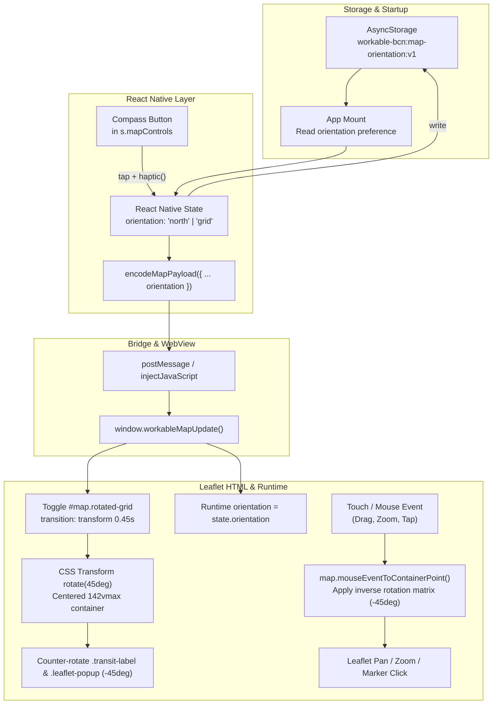

# Dual Map Orientation: Barcelona Grid & North-Up Design

## Summary

Provide a two-mode orientation toggle for the Barcelona map:
1. **Standard Mode (`'north'`):** North is up, South is down (0° rotation).
2. **Barcelona Grid Mode (`'grid'`):** The map is rotated 45° clockwise (Muntanya-Mar orientation: Tibidabo/Collserola mountains at the top, Mediterranean Sea at the bottom). The tilted Eixample Cerdà grid aligns horizontally and vertically with the device screen.

The feature includes a responsive Compass button in the floating map controls that indicates true North and acts as a two-way toggle with haptic feedback, counter-rotated station labels and popups for horizontal legibility, inverse coordinate mapping in the Leaflet runtime for pixel-accurate dragging and tapping, and persistence across app restarts via `AsyncStorage`.

---

## 1. Problem & User Objectives

1. **Urban Geometry of Barcelona:** The iconic Eixample street grid designed by Ildefons Cerdà runs at an angle of roughly 45° to the geographic meridian. Avenues such as Gran Via, Aragó, Mallorca, and València run parallel to the coastline, while Passeig de Gràcia, Balmes, Muntaner, and Pau Claris run perpendicular (mountain to sea).
2. **The "Muntanya – Mar" Mental Model:** Residents and frequent visitors navigate Barcelona using "Muntanya" (mountain) and "Mar" (sea). Displaying the map with North-Up forces the entire grid to appear diagonally, making it harder to scan rectangular blocks and navigate streets.
3. **Core Objectives:**
   - Provide two clean presets: Standard (`0°`) and Barcelona Grid (`+45°`).
   - Compass button in map controls: indicates true North (arrow points straight up in standard mode, tilts 45° clockwise in grid mode) and toggles modes on tap.
   - Smooth 60fps GPU-accelerated transition between orientations.
   - Exact touch/drag/pinch alignment: dragging the map in rotated mode must move the map directly under the user's finger with zero drift.
   - Station labels (`transit-label`) and popup cards counter-rotate to remain strictly horizontal and legible.
   - Persist orientation preference across app sessions in `AsyncStorage`.

---

## 2. Architecture & Data Flow



---

## 3. UI & State Management (`App.tsx`)

### 3.1 Orientation Type & Storage
```typescript
export type MapOrientation = 'north' | 'grid';
const ORIENTATION_KEY = 'workable-bcn:map-orientation:v1';
```
* **Default state:** `'north'`.
* **Initialization:** Read `AsyncStorage.getItem(ORIENTATION_KEY)` on app mount. If `'grid'`, update state without resetting camera.
* **Toggle Action:**
  ```typescript
  const toggleOrientation = useCallback(() => {
    const next = orientation === 'north' ? 'grid' : 'north';
    setOrientation(next);
    haptic();
    void AsyncStorage.setItem(ORIENTATION_KEY, next).catch(() => {});
  }, [orientation]);
  ```

### 3.2 Compass Button in `s.mapControls`
Placed in the existing floating control stack (`top: 16, right: 16`), above the Metro toggle and Locate buttons:
```tsx
<Pressable
  accessibilityRole="button"
  accessibilityLabel={orientation === 'grid' ? 'Reset map orientation to North' : 'Rotate map to Barcelona grid'}
  onPress={toggleOrientation}
  style={[s.mapButton, orientation === 'grid' && s.mapButtonActive]}
>
  <View style={{ transform: [{ rotate: orientation === 'grid' ? '45deg' : '0deg' }] }}>
    <Ionicons
      name="compass-outline"
      size={24}
      color={orientation === 'grid' ? colors.tomato : colors.ink}
    />
  </View>
</Pressable>
```
* In `'north'` mode: needle points straight up (North is up).
* In `'grid'` mode: needle points 45° clockwise (pointing toward true North in the upper-right corner of the rotated view), and button background displays active styling (`colors.honey`).

---

## 4. Bridge Protocol (`src/utils/map-bridge.ts`)

`MapPayload` is extended with an optional `orientation` property:
```typescript
export type MapPayload = {
  places: Place[];
  selectedId: string | null;
  userLocation: Coordinates | null;
  friendLocation?: Coordinates | null;
  meetMode?: boolean;
  cameraCommand: CameraCommand | null;
  chainColors?: Record<string, string>;
  topMatchIds?: string[];
  showMetro?: boolean;
  orientation?: MapOrientation;
};
```
* `encodeMapPayload` automatically serializes `orientation`.
* Backward-compatible: defaults to `'north'` if undefined.

---

## 5. Map Layout & CSS (`src/map/map.css`, `scripts/build-map.mjs`)

### 5.1 Centered Oversized Container
To eliminate viewport corner cutoffs during a 45° rotation on any device aspect ratio, `#map` is sized to $142\text{vmax} \times 142\text{vmax}$ ($\sqrt{2} \approx 1.414$) and centered:
```css
html, body {
  width: 100%;
  height: 100%;
  margin: 0;
  overflow: hidden;
  position: relative;
  background: #f0f1ec;
}

#map {
  position: absolute;
  width: 142vmax;
  height: 142vmax;
  left: 50%;
  top: 50%;
  margin-left: -71vmax;
  margin-top: -71vmax;
  transform: rotate(0deg);
  transform-origin: center center;
  transition: transform 0.45s cubic-bezier(0.25, 1, 0.5, 1);
}

#map.rotated-grid {
  transform: rotate(45deg);
}
```

### 5.2 Counter-Rotation of Legible Overlays
Station tooltips and popup cards counter-rotate so text remains strictly horizontal.

> [!IMPORTANT]
> **CSS Transforms Level 2 Isolation:**
> Leaflet positions `.leaflet-tooltip` and `.leaflet-popup` via inline `style.transform = translate3d(Xpx, Ypx, 0px)`.
> Under CSS Transforms Level 2, independent CSS transform properties (`rotate`, `translate`, `scale`) are evaluated *before* the `transform` property. If `rotate: -45deg` is applied directly to `.leaflet-tooltip` or `.leaflet-popup`, the browser rotates the translation vector $(X, Y)$ by $-45^\circ$, flinging the overlays hundreds of pixels away from the station markers and causing them to drift during panning.
> To prevent this collision, the outer containers retain Leaflet's `translate3d(...)` unperturbed, and counter-rotation is applied to child elements that sit at local $(0, 0)$:

```css
.rotated-grid .leaflet-tooltip.transit-label .transit-label-text {
  display: inline-block;
  transform: rotate(-45deg);
  transform-origin: 0 50%;
}

.rotated-grid .leaflet-popup .leaflet-popup-content-wrapper {
  transform: rotate(-45deg);
  transform-origin: center center;
}

.rotated-grid .leaflet-popup .leaflet-popup-tip-container {
  display: none;
}
```
Circle markers (`L.circleMarker`) for cafes, metro stations, user location, and friend pin are rotation-invariant and require no counter-rotation.

---

## 6. Leaflet Runtime & Touch Coordinate Projection (`src/map/map-runtime.js`)

### 6.1 State and DOM Update
```javascript
let currentOrientation = 'north';

// Inside workableMapUpdate(encoded):
const state = JSON.parse(decodeURIComponent(encoded));
const newOrientation = state.orientation || 'north';
if (newOrientation !== currentOrientation) {
  currentOrientation = newOrientation;
  const mapEl = document.getElementById('map');
  if (mapEl) {
    if (currentOrientation === 'grid') {
      mapEl.classList.add('rotated-grid');
    } else {
      mapEl.classList.remove('rotated-grid');
    }
  }
  map.invalidateSize({ pan: false });
}
```

### 6.2 Inverted Touch Coordinate Projection
When `#map` is rotated by $\theta = +45^\circ$, Leaflet's default `mouseEventToContainerPoint` fails because `getBoundingClientRect()` returns the unrotated axis-aligned bounding box.

We wrap `map.mouseEventToContainerPoint`:
```javascript
const originalMouseEventToContainerPoint = map.mouseEventToContainerPoint.bind(map);
map.mouseEventToContainerPoint = function (e) {
  if (currentOrientation !== 'grid') {
    return originalMouseEventToContainerPoint(e);
  }
  const cx = window.innerWidth / 2;
  const cy = window.innerHeight / 2;
  const size = map.getSize();
  const mx = size.x / 2;
  const my = size.y / 2;
  
  const dx = e.clientX - cx;
  const dy = e.clientY - cy;

  // Inverse rotation: angle = -45°, cos = 1/√2
  const cos = Math.SQRT1_2;
  const localDx = (dx + dy) * cos;
  const localDy = (dy - dx) * cos;

  return new L.Point(mx + localDx, my + localDy);
};
```
* **Pinch Zoom:** The centroid of two touches maps to the correct geographic point via `mouseEventToContainerPoint`.
* **Marker & Map Clicks:** Tapping cafes or setting origin pins in Meet Halfway mode works seamlessly with pixel accuracy.

### 6.3 Map Pan / Drag Projection (`L.Draggable` and `L.DomUtil.getScale`)
Leaflet's map panning (`L.Draggable`) operates on raw screen coordinates (`clientX`, `clientY`) directly from DOM touch/mouse events and applies the delta directly to `map._mapPane` without calling `mouseEventToContainerPoint`. In addition, `L.DomUtil.getScale` inspects `getBoundingClientRect()`, which on a 45°-rotated element reports $\sqrt{2} \times$ width/height as apparent scale.

To ensure panning moves the map 1:1 under the user's finger in grid orientation:
1. `L.DomUtil.getScale` is wrapped for `#map` in grid orientation to return `{ x: 1, y: 1 }`, preventing false scale division.
2. `L.Draggable.prototype._updatePosition` (and `map.dragging._draggable`) is wrapped to inverse-rotate the screen displacement by $-45^\circ$ before applying it to `map._mapPane`:
```javascript
const dx = (this._newPos.x - this._startPos.x) * scaleX;
const dy = (this._newPos.y - this._startPos.y) * scaleY;
const cos = Math.SQRT1_2;
const localDx = (dx + dy) * cos;
const localDy = (dy - dx) * cos;
this._newPos = new L.Point(this._startPos.x + localDx, this._startPos.y + localDy);
```
3. Inertia movement (`map.panBy`) naturally preserves the rotated velocity vector because `_lastPos` and `_positions` reflect the rotated pane positions.

### 6.4 Transit Station Touch Targets & Proximity Hit Detection
Station circle markers have small visual radii (3–4.5px, 6–9px diameter) to keep the transit network legible without cluttering café markers. To make tapping effortless on mobile touchscreens (44–48px guidelines):
1. **Interactive Station Labels:** `.leaflet-tooltip.transit-label` is styled with `pointer-events: auto; cursor: pointer;` when visible (zoom $\ge 14$ for hubs, zoom $\ge 15$ for all stations). Tapping the station name directly invokes `stMarker.openPopup()` and calls `L.DomEvent.stopPropagation()`.
2. **Proximity Tap Detection:** In `map.on('click')`, when `state.showMetro` is active, the Euclidean distance from the tap point to all station markers is computed in container coordinates:
   - If a tap lands within $26\text{px}$ of a transit station, the closest station's popup is opened.
   - If a café and a transit station both lie within $26\text{px}$ of the tap, the closer entity wins.
   - Tap misses do not trigger `mapClick` (preventing accidental origin pin placement in Meet Halfway mode).

---

## 7. Verification Plan

### Automated Tests
1. **`tests/map-bridge.test.ts`:**
   - Verify `encodeMapPayload` and `decodeMapPayload` preserve `orientation: 'grid'` and `orientation: 'north'`.
   - Verify default fallback when `orientation` is omitted.
2. **`tests/map-document.test.ts`:**
   - Verify generated HTML contains `#map.rotated-grid`, counter-rotation CSS rules for `.transit-label` and `.leaflet-popup`.
   - Verify runtime projection math with unit assertions.
3. **Build & Typecheck:**
   - `npm run map:build`
   - `npm run typecheck`
   - `npm test`

### Manual Verification
- Launch on Web / mobile preview.
- Toggle compass button: verify smooth 45° rotation transition.
- Verify drag panning in grid mode follows finger direction 1:1.
- Verify cafe markers are selectable by tap.
- Verify transit station names and popups are upright.
- Verify reload restores the saved orientation mode.
